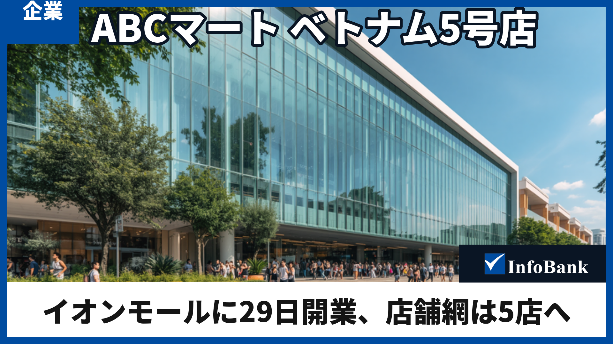
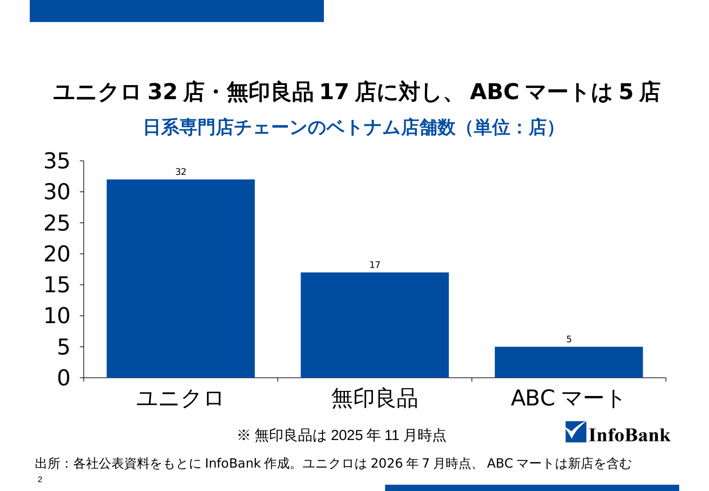
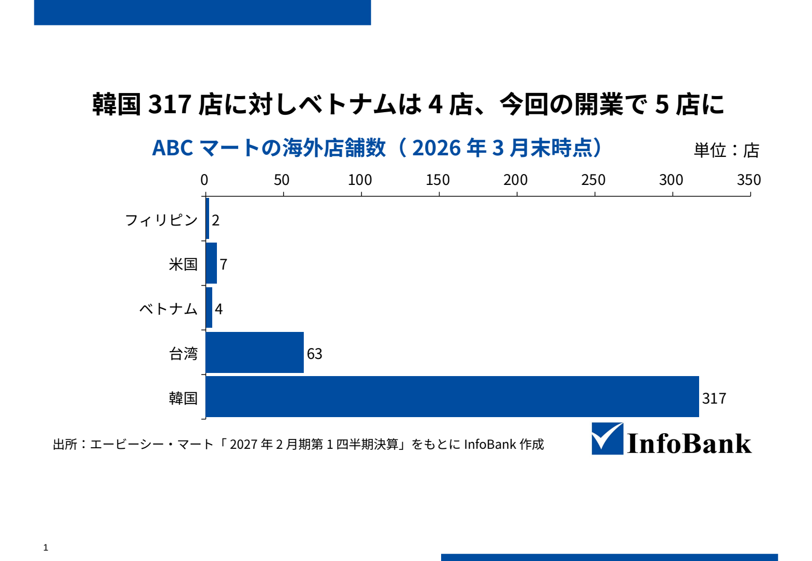

# ABCマート、ベトナム5号店をイオンモールに29日開業

> **メタディスクリプション（84字）**  
> 靴小売り大手ABCマートが8月29日、ホーチミン市のイオンモールにベトナム5号店を開業する。現地法人として初のモール出店で、1月の閉店で4店に減った店舗網が5店に戻る。

*サムネイル（TYPE C・1920×1080）。背景写真は仮画像、ロゴは支給テンプレートから抽出した実ロゴ。*

---

靴小売りチェーン大手の株式会社エービーシー・マート（以下、ABCマート）のベトナム法人ABCマート・ベトナムは8月29日、ホーチミン市の商業施設「イオンモール・タンフーセラドン」に**ベトナム5号店**を開業する。**現地法人として初のイオンモールへの出店**で、2026年1月の閉店により4店へ減っていた店舗網は5店に戻る。

IR資料によれば、ベトナムでの新規出店は**3年ぶりの再開**だ。内需拡大が続く同国では日系専門店の出店が相次いでおり、靴専門店最大手の動きは日系小売り各社にとっても市場の温度を測る材料となる。

## ABCマートの新店は454平方メートル、キッズコーナーは国内最大級

新店の名称は「ABCマート グランドステージ イオンモール タンフーセラドン店」。**総面積は454平方メートル**で、合計20ブランドを取り扱う。**ベトナム国内最大級というキッズコーナー**も新設する。2023年に開業した旗艦のサイゴンセンター店に次ぐ規模だ。

## 出店先のイオンモールはベトナム1号店から8施設へ拡大

出店先のイオンモール・タンフーセラドンは、**2014年1月に開業したイオンモールのベトナム1号店**だ。イオンモールは同国で8施設を運営しており、イオンは2030年度末までにベトナムのショッピングセンターを約30カ所へ増やす計画を示しており、モール網の拡大は出店先の選択肢を広げる。

## ABCマートのベトナム進出4年、店舗数は5店で足踏み

ABCマートのベトナム進出は2022年10月。ホーチミン市1区に**グループ初の東南アジア店舗**を構えたのが始まりだ。2023年には4店を相次いで開き、秋のサイゴンセンター店で店舗網は5店に広がった。だが決算資料によれば、その1号店にあたるドンコイ店が契約条件の都合で**2026年1月に閉店**し、3月末時点の店舗数は4店に減っている。今回の開業は、いったん欠けた5店目を埋め直すものにあたる。

店舗の分布は見え方も変わった。2025年7月の行政再編でビンズオン省などがホーチミン市に統合されたため、3地域に分かれていた店舗網は現在、ホーチミン市とハノイ市の2市に収まる。

日系専門店のベトナム展開では、**ユニクロが32店**（2026年7月時点）、**無印良品が19店**（2026年8月時点）を構える。主力商材が違うため単純比較はできないが、ABCマートの5店はまだその水準に届いていない。

**【日系専門店チェーンのベトナム店舗数】**  
（出所）各社公式店舗一覧・公表資料をもとにInfoBank作成。ユニクロは2026年7月時点、無印良品は2026年8月時点、ABCマートは新店を含む。

## IR資料が示すベトナム事業の現在地と中期目標20店

同社が2026年4月に公表したIR資料では、ベトナムとフィリピンは韓国・台湾より前の**「パイロットショップ／トライアル出店」の段階**に置かれ、多店舗出店フェーズへ移行するタイミングを図るとされた。同社は**海外売上比率をグループの半分以上へ引き上げる**中長期目標を掲げており、店舗数で韓国・台湾に大きく離されたベトナムは伸びしろの一つにあたる。

では事業の到達点と今後の出店計画はどうか。IR資料と現地統計が、その現在地を数字で示している。

**【ABCマートの海外店舗数（2026年3月末時点）】**  
（出所）エービーシー・マート「2027年2月期第1四半期決算」をもとにInfoBank作成。

---

> 🔒 **ここから会員限定**（本番はこの位置にショートコードを挿入）  
> `[content_control logged_in="true"]`

*テスト形式のため、以下も全文を掲載しています。*

進出時の計画には届いていない。2022年10月の発表時、同社は**2023年度までに6店**を出す計画を示していた。実際には5店で止まり、その後1店を閉じている。2023年にはサイゴンセンター店が「5号店」と報じられており、今回の「5号店」は閉店を経た数え直しにあたる。

事業規模もまだ小さい。ベトナムの売上高は**6億8,800万円**で連結売上高の0.2%にとどまる（海外子会社は12月決算のため2025年1〜12月）。5店で割ると1店あたり約1億4千万円だ。2026年3月末の店舗数も韓国317店・台湾63店に対しベトナムは4店と桁が違う。IR資料が試験出店の段階に置く背景には、この差がある。

もっとも、会社が描く絵は5店では終わらない。同じIR資料は**ベトナムの中期目標として20店**を掲げ、2026年秋にグランドステージ業態で2店を出す計画も示した。現地報道によれば、そのうち1店は2026年内に開くイオンモール・ビンタン店とされる。

市場環境も追い風だ。ホーチミン市の小売・消費サービス売上高は2026年1〜7月に**前年同期比13.3%増**となった（旧ビンズオン省などを含む新市域ベース）。2025年のベトナムの皮革・履物・かばん産業の輸出額も290億ドルに迫り、うち靴が240億ドル超を占めた。「作る国」に「売れる市場」が重なりつつあるいま、中期目標20店に向けた歩みは、まずこの秋の2店の立ち上がりが左右することになりそうだ。

> 🔒 **会員限定ここまで**  
> `[/content_control]`  
> `[member_cta_buttons]`

---

## 納品メモ（編集部確認用）

- 本文 **1713字**（無料公開 1106字 ／ 会員限定 607字・公開比率 **64.6%**）
- 図表2点は **PowerPoint形式（figures.pptx）** で納品。支給テンプレートのネイティブグラフを流用し、フォントは Meiryo UI を明示指定
- サムネイル1点（TYPE C）。3パターンを記事ごとに交互使用する運用

### タイトル案（26〜28字・「ベトナム」必須）

1. ABCマート、ベトナム5号店をイオンモールに29日開業　<27字>**（採用）**
2. ABCマート、ベトナムで出店再開へ　イオンモールに5号店　<28字>
3. ABCマート、ベトナム5号店をホーチミンのイオンモールに　<28字>
4. ABCマートのベトナム店舗網5店へ　イオンモールに初出店　<28字>
5. ABCマートがベトナム5店目、イオンモールへ29日出店　<27字>

### 制作ルールの自動検証（Final Gates）

| 判定 | 項目 | 実測 | 期待 |
|---|---|---|---|
| PASS | T01 タイトル文字数 | [27, 28, 28, 28, 27] | 26-28字 |
| PASS | T02 「ベトナム」含有 | 5/5 | 全案 |
| PASS | T03 タイトル案数 | 5案 | 3案以上 |
| PASS | M01 メタディスクリプション | 84字 | 80-90字 |
| PASS | B01 本文文字数 | 1713字 | 1,275-1,725字 |
| PASS | B02 H2見出し数 | 4本 | 2本以上 |
| PASS | B03 H2キーワード | 未充足0本 | 全H2 |
| PASS | F01 図表枚数 | 2枚 | 2枚 |
| PASS | G01 公開比率 | 64.6%（1106/1713字） | 60-70% |
| PASS | SC01 ショートコード構造 | 開始1/終了1/CTA1・順序OK | 各1回・正順 |
| PASS | F02 図表キーメッセージ | [26, 28] | 28字以内 |
| PASS | F03a 図表タイトル改行なし | 改行0件 | 0件（一次判定） |
| PASS | CIT01 引用表記 | 2件中2件 | 全図表 |
| PASS | FONT01 Meiryo UI明示指定 | Meiryo UI 96箇所 | Meiryo UIのみ |
| PASS | BRAND01 ブランド表記統一 | InfoBankのみ | InfoBankのみ |
| PASS | TH01 サムネイル1枚・構成 | TYPE C・機械QA合格 | 1枚・型準拠 |
| PASS | TH02 ロゴは実ファイル | assets/infobank_logo/infobank_logo_white.png | 偽ロゴ禁止 |
| STUB | RULE01 ルールhash | f5502a4fb50e3591... | hash記録 |
| STUB | IMG01 画像provider | canva_generated_placeholder | Magnific（本番） |
| PASS | FC01 全claimにEvidence | 28件（VERIFIED 17 / PARTIAL 11） | 未裏付け0件 |
| PASS | FC02 ソース矛盾なし | 0件 | 0件 |
| REVIEW | FC03 Double Check充足 | 要確認7件 ['C004', 'C005', 'C009', 'C010', 'C012', 'C025', 'C027'] | 数値・日付は複数ソース |

※ STUB は外部サービス未接続のため代替した項目。REVIEW は工程を止めないが承認前の目視確認が必要な項目。（終了コード 0）

### ファクトチェック（全claim × 出典）

| ID | 内容 | 判定 | 出典 |
|---|---|---|---|
| C001 | ABCマート（エービーシー・マート）は2026年8月29日、ホーチミン市の商業施設「イオンモ | VERIFIED | [NNA ASIA（主情報源・記事2956658）＋VIETJOベトナムニュース](https://www.nna.jp/news/2956658) |
| C002 | 今回の出店はABCマート・ベトナム（現地法人）にとってイオンモールへの初出店である | PARTIAL | [VIETJOベトナムニュース](https://www.viet-jo.com/news/nikkei/260808110337.html) |
| C003 | 新店の名称は「ABCマート グランドステージ イオンモール タンフーセラドン店」 | PARTIAL | [VIETJOベトナムニュース](https://www.viet-jo.com/news/nikkei/260808110337.html) |
| C004 | 新店の総面積は454平方メートル | PARTIAL | [VIETJOベトナムニュース](https://www.viet-jo.com/news/nikkei/260808110337.html) |
| C005 | 新店は20ブランドを取り扱う | PARTIAL | [VIETJOベトナムニュース](https://www.viet-jo.com/news/nikkei/260808110337.html) |
| C006 | 新店はベトナム国内最大級というキッズコーナーを備える | PARTIAL | [VIETJOベトナムニュース](https://www.viet-jo.com/news/nikkei/260808110337.html) |
| C008 | イオンモール・タンフーセラドンは2014年1月に開業したイオンモールのベトナム1号店 | VERIFIED | [Báo Đầu tư（＋イオンモール公式リリースで補強）](https://baodautu.vn/aeon-viet-nam-khai-truong-aeon-mall-tan-phu-celadon-d8892.html) |
| C009 | イオンモールはベトナムで8施設を運営している | PARTIAL | [ジェトロ ビジネス短信／食品新聞](https://www.jetro.go.jp/biznews/2026/07/343133b7ccbbbca2.html) |
| C010 | イオンは2030年度末までにベトナムのショッピングセンターを30カ所へ増やす計画を示している | PARTIAL | [日本経済新聞](https://www.nikkei.com/article/DGXZQOGM036F30T00C26A7000000/) |
| C011 | ABCマートのベトナム進出は2022年10月、ホーチミン市1区に東南アジア初の店を構えたのが | VERIFIED | [エービーシー・マート ニュースリリース（＋ジェトロで補強）](https://www.abc-mart.co.jp/ir/pdf/2023/221012_2.pdf) |
| C012 | 2023年に4店を相次いで開き、秋のサイゴンセンター店で店舗網は5店に広がった | PARTIAL | [ジェトロ 地域・分析レポート／VIETJO](https://www.jetro.go.jp/biz/areareports/2024/956df6efd23a51d3.html) |
| C013 | 1号店にあたるドンコイ店が契約条件の都合で2026年1月に閉店し、2026年3月末時点の店舗 | VERIFIED | [エービーシー・マート 決算説明会資料p.19／2027年2月期1Q決算短信](https://www.abc-mart.co.jp/ir/pdf/2026/kessan04_siryou2.pdf) |
| C014 | 2025年7月の行政再編でビンズオン省がホーチミン市に統合された | PARTIAL | [ベトナム国会決議 202/2025/QH15／VTV（国営放送）](https://vtv.vn/chinh-thuc-hop-nhat-tp-ho-chi-minh-binh-duong-va-ba-ria-vung-tau-thanh-tp-ho-chi-minh-moi-100250630113950519.htm) |
| C015 | 2026年4月公表のIR資料で、ベトナムとフィリピンは韓国・台湾より前の「パイロットショップ | VERIFIED | [エービーシー・マート 決算説明会資料p.15「出店フェーズ」](https://www.abc-mart.co.jp/ir/pdf/2026/kessan04_siryou2.pdf) |
| C016 | ABCマートは海外売上比率をグループの半分以上へ引き上げる目標を掲げている | VERIFIED | [エービーシー・マート FACTBOOK 2026年2月期 トップインタビュー](https://www.abc-mart.co.jp/ir/pdf/2026/2602_factbook.pdf) |
| C017 | ユニクロのベトナム店舗数は32店（2026年7月時点） | VERIFIED | [ユニクロ公式ストアロケーターAPI（＋Thanh Niên／Báo Thanh Hóa報道）](https://map.uniqlo.com/vn/api/storelocator/v1/en/stores?offset=0&r=storelocator) |
| C018 | 無印良品のベトナム店舗数は19店（2026年8月時点） | VERIFIED | [MUJI Vietnam公式サイト 店舗一覧（直接カウント）](https://www.muji.com.vn/vn/page/store-location) |
| C019 | 2022年10月の発表時、ABCマートは2023年度までに6店を出す計画を示していた | VERIFIED | [エービーシー・マート ニュースリリース](https://www.abc-mart.co.jp/ir/pdf/2023/221012_2.pdf) |
| C020 | 2023年にサイゴンセンター店が「5号店」と報じられていた | VERIFIED | [VIETJO／Tiếp thị & Tiêu dùng](https://www.viet-jo.com/news/nikkei/230914181000.html) |
| C021 | ABCマートのベトナム売上高は6億8,800万円で連結売上高の0.2％（海外子会社は12月決 | VERIFIED | [エービーシー・マート FACTBOOK 2026年2月期 セグメント別売上高構成](https://www.abc-mart.co.jp/ir/pdf/2026/2602_factbook.pdf) |
| C022 | 2026年3月末の店舗数は韓国317店・台湾63店・ベトナム4店 | VERIFIED | [エービーシー・マート 2027年2月期 第1四半期決算短信](https://www.abc-mart.co.jp/ir/pdf/2027/kessan01.pdf) |
| C023 | IR資料はベトナムの中期目標として20店を掲げている | VERIFIED | [エービーシー・マート 決算説明会資料p.4「海外マーケット」](https://www.abc-mart.co.jp/ir/pdf/2026/kessan04_siryou2.pdf) |
| C024 | 2026年秋にグランドステージ業態で2店を出す計画が示されている | VERIFIED | [エービーシー・マート 決算説明会資料p.19「ベトナム」](https://www.abc-mart.co.jp/ir/pdf/2026/kessan04_siryou2.pdf) |
| C025 | そのうち1店は2026年内に開くイオンモール・ビンタン店とされる（現地報道） | PARTIAL | [VIETJOベトナムニュース](https://www.viet-jo.com/news/nikkei/260808110337.html) |
| C026 | ホーチミン市の小売・消費サービス売上高は2026年1〜7月に前年同期比13.3％増（旧ビンズ | VERIFIED | [ホーチミン市人民委員会 記者会見資料（数値の出所はホーチミン市統計支局）](https://www.vietnam.vn/en/thong-cao-bao-chi-phien-hop-danh-gia-tinh-hinh-kinh-te-xa-hoi-thang-7-7-thang-dau-nam-va-nhiem-vu-giai-phap-trong-tam-thang-8-nam-2026) |
| C027 | 2025年の皮革・履物・かばん産業の輸出額は290億ドルに迫り、うち靴が240億ドル超を占め | PARTIAL | [ベトナム通信社（BNEWS／数値の出所はLEFASO）／Báo Nhân Dân](https://bnews.vn/nganh-da-giay-chu-dong-chuyen-doi-xanh-tu-chu-chuoi-cung-ung/428629.html) |
| C028 | 図表1: ABCマートの海外店舗数（2026年3月末時点）フィリピン2・米国7・ベトナム4・ | VERIFIED | [エービーシー・マート 2027年2月期1Q決算短信／決算説明会資料p.7](https://www.abc-mart.co.jp/ir/pdf/2027/kessan01.pdf) |
| C029 | 図表2: 日系専門店チェーンのベトナム店舗数 ユニクロ32・無印良品19・ABCマート5 | VERIFIED | [ユニクロ公式ストアロケーターAPI／MUJI Vietnam公式店舗一覧／ABCマート1Q短信+NNA](https://www.muji.com.vn/vn/page/store-location) |

### 承認前の確認事項：裏付けが単一ソースの数値・日付（7件）

- **C004**：数値claimだが単一二次情報。Double Check未充足。
- **C005**：数値claimだが単一二次情報。
- **C009**：「イオンモール」ブランドなら8で二次2件が一致。ただし日経は中型施設を含め9カ所とする。定義差あり。
- **C010**：単一の二次情報（ただし権威ある媒体）。同記事は現状を9カ所とし、C009の8とは基準が異なる。
- **C012**：「2023年に4店開いて計5店」は一致。ただし5号店の月が食い違う（ジェトロ=10月、VIETJO=9月30日開業）。記事の「9月の」は断定を避けるべき。 記事側を「秋のサイゴンセンター店」へ修正し、月の断定を回避した。
- **C025**：ビンタン店の2026年内出店予定は単一二次情報で確認。記事の「現地報道によれば」という留保は妥当。
- **C027**：独立2媒体（BNEWS／Nhân Dân）が「gần 29 tỷ USD＝290億ドルに迫る」で一致。産業全体と靴の切り分けも記事と一致。ただし原文は「迫った」であり、記事の「達し」は過大。統計局の通年確定値は本セッションから取得不可（503）。 記事側を「290億ドルに迫り」へ修正し、原文の gần（〜に迫る）と一致させた。
